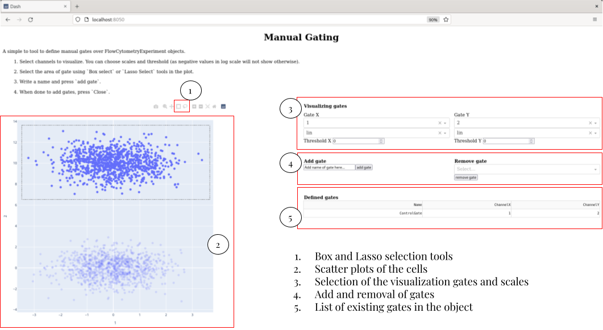

# Usage

We are going over the main functionality of the FlowCytometry package.

For this tutorial you will need to have installed the following packages:

 - FlowCytometry 
 - Plots for the visualization of the results
 - CSV for uploading files
 - DataFrames as storage 
 
First we upload the required packages.


```julia
using FlowCytometry
using Plots
using CSV
using DataFrames
```


<div style="padding: 1em; background-color: #f8d6da; border: 1px solid #f5c6cb; font-weight: bold;">
<p>The WebIO Jupyter extension was not detected. See the
<a href="https://juliagizmos.github.io/WebIO.jl/latest/providers/ijulia/" target="_blank">
    WebIO Jupyter integration documentation
</a>
for more information.
</div>


## Basics of the FlowCytometry.jl structures

The Flow cytometry package works around a few structures that help with the upload and manipulation of flow cytometry data.

The basic structure is **FlowCytometryExperiment**. The structure follows a very similar struture to the AnnData object for scRNA seq analysis of [Scanpy](https://scanpy.readthedocs.io/en/latest/usage-principles.html#anndata).

### Loading

We can construct it manually starting from a measures matrix. Let's make a initialization of experiment with 100 cells and 10 channels.


```julia
fcs = FlowCytometryExperiment(rand(100,10));
```

Alternatively, we can directly load a fcs experiment.


```julia
fcs = loadFCExperiment("FlowRepository_FR-FCM-Z2SS_files/Compensation Controls_APC Stained Control_006.fcs");
```

### Accesing the properties

The structure contains several properties useful for the analysis.

 - **X** Matrix of Cells X Channel of the experiment.
 - **obs** Dataframe with all the metainformation of the cells
 - **var** Dataframe with all the metainformation of the channels
 - **obsm** Dictionary containing transformed matrices of the original data.
 - **layers** Dictionary containing Cells X Channel matrices of data that are required to control (e.g. Raw matrix).
 - **gates** List of Gate and Gate set objects
 - **uns** Dictionary contining all the metainformation of algorithms applied to the data.
 
The data uploaded before contains for now a matrix with 5000 cells and 35 channels.


```julia
fcs.X
```


    5000×35 Matrix{Float64}:
     2303.74      416.599   1283.72    …  164.319   112.581     806.962
       74.9271    118.738     38.9001     103.387    43.4448     31.328
       -8.80664    37.3513    69.7797      53.6129  -12.1771     16.3808
       13.1381     74.3996   117.378      113.407    58.6642    109.884
       61.805     154.62      83.2257     151.944    61.3532     92.8747
      120.452     149.492    118.274   …  126.721    28.8629     98.2071
       47.0315     90.03      65.6665      59.3534   40.6711     45.4934
     3250.81      510.924   1784.68        83.2978  149.613    1271.07
      129.82      171.005    104.946      218.265    89.9069    138.593
     4507.53      762.57    2983.45       151.153   175.381    1292.75
       44.5258     98.8863    90.7532  …   96.0772    7.18318    72.9165
     3067.69      499.695   1977.24       184.278   133.984     779.138
      106.038      73.6164    72.8483      91.8869   30.9219     83.9338
        ⋮                              ⋱                       
     4526.39      922.335   3162.07       228.424   163.164    1784.55
     3204.06      453.676   1997.38       117.517    92.6973    995.466
     3541.12      521.124   2009.79    …   96.7421  142.616    1033.12
      110.326      96.0595    92.4247     104.981    64.8256     76.8489
     4377.92      790.997   3020.12       156.357   163.928    1571.42
      162.128     197.74     165.195      135.382    49.7978    116.674
     1854.82     1089.18    1323.15       522.704   530.454    1234.77
     4850.33     1584.76    3109.43    …  703.122   539.034    1849.48
       62.8767    123.013    162.019       88.8254   57.7122     17.3599
      133.58      103.552     55.547       87.4273   24.1988    263.921
      -28.8662    110.622    198.375       68.2685   25.5013     98.1429
        4.39487    97.8623   130.614       88.426    38.1077     31.6543


The experiment metainformation has been stored in `.uns["ExperimentInformation"]`.


```julia
fcs.uns["ExperimentInformation"]
```


    Dict{String, String} with 370 entries:
      "\$P7G"            => "1.0"
      "\$P22E"           => "0,0"
      "\$P26E"           => "0,0"
      "CREATOR"          => "BD FACSDiva Software Version 8.0.1"
      "\$P34R"           => "262144"
      "\$P27E"           => "0,0"
      "\$FIL"            => "Compensation Controls_APC Stained Control_006.fcs"
      "\$P2R"            => "262144"
      "\$P11V"           => "495"
      "\$P25R"           => "262144"
      "\$P2G"            => "1.0"
      "P5BS"             => "0"
      "P2DISPLAY"        => "LIN"
      "LASER5DELAY"      => "31.30"
      "P29DISPLAY"       => "LOG"
      "P32DISPLAY"       => "LOG"
      "P3MS"             => "0"
      "\$P24R"           => "262144"
      "\$P9G"            => "1.0"
      "\$P14B"           => "32"
      "P27DISPLAY"       => "LOG"
      "EXPORT USER NAME" => "CarlyWhyte"
      "\$P10B"           => "32"
      "\$P9N"            => "BB660-P-A"
      "\$P3E"            => "0,0"
      ⋮                  => ⋮


And we have the name of the channels in `.channels`.


```julia
fcs.channels
```


    35-element Vector{String}:
     "PE-Cy5.5-A"
     "BB660-P-A"
     "BV650-A"
     "BUV615-P-A"
     "BYG790-A"
     "SSC-H"
     "BV786-A"
     "SSC-W"
     "BV570-A"
     "APC-A"
     "BV421-A"
     "PE-CF594-A"
     "BB700-P-A"
     ⋮
     "BYG670-A"
     "BUV661-A"
     "BV750-P-A"
     "FITC-A"
     "APC-R700-A"
     "BB630-A"
     "BUV496-A"
     "BUV737-A"
     "BYG584-A"
     "BUV563-A"
     "BB790-P-A"
     "BV711-A"


It is useful to note than the channels can be accessed directly by calling directly to the FlowCytometryExperiment object as `fcs[channel_of_interest]`. Let's use this property for ploting a scatterplot of two channels.


```julia
scatter(fcs["APC-A"],fcs["APC-R700-A"],label="cells",xlabel="APC-R700-A",ylabel="APC-A",title="Control experiment APC Dye")
```


    

    


We can already see from this data the spillover effect of APC-A to APC-R700-A.

## Gating

Flow compensation usually requires of quality control of the cells and measures change in proportion of cells between experimennts to see if there is changes in the number of cells present in specific regions of the channel space.

We can define gates for our experiment in several ways.

### Manual gating

We can define a manual gates by calling the function `Gating.manualGating!`. This will start an app that can be accessed in any browser by writing `localhost::channel`, for the channel prompted by the function. When desiring to stop adding gates, you will have just to kill the app with `ctr+C` or similar and the gates will be added to the `FlowCytometryExperiment` object.


```julia
Gating.manualGating!(fcs)
```

    ┌ Info: Listening on: 0.0.0.0:8050
    └ @ HTTP.Servers /home/gabriel/.julia/packages/HTTP/aTjcj/src/Servers.jl:268


When calling the function, in the browser you will see a page like this:




## Compensation

Most part of flow cytometry experiments use several signaling channels. Some of the most common experimental as flow cytometry or spectral cytometry suffer from spillover/mixing of the information among the channels. To correct this behavior and having uncoupled signals, one-fluorophore control experiments are performed in order to compute what is called the compensation matrice to uncouple the channels.

### Loading control experiments

We can upload the control experiments in a special structure named `FlowCytometryControl`, that is more less a container of diferent `FlowCytometryExperiment`. Each control experiment is assigned a channel that corresponds to the maximum peack of its spectrum. This is very important to when computing the compensation matrix. The best way of uploading the data is by assigning the different control files to the according channels.

In this example we have a file that has already this assignation:


```julia
controls = CSV.read("FlowRepository_FR-FCM-Z2SS_files/attachments/fcs_control.csv",FlowCytometry.DataFrame)
print(controls[1:5,:])
```

    5×4 DataFrame
     Row │ filename                           dye         antigen     wavelength 
         │ String                             String15    String15    Int64      
    ─────┼───────────────────────────────────────────────────────────────────────
       1 │ Compensation Controls_APC Staine…  APC-A       CD4/CD8            660
       2 │ Compensation Controls_APC-H7 Sta…  APC-H7-A    viability          785
       3 │ Compensation Controls_APC-R700 S…  APC-R700-A  MHC-II             719
       4 │ Compensation Controls_BB630 Stai…  BB630-A     CD3/Thy1.2         631
       5 │ Compensation Controls_BB660-P St…  BB660-P-A   CD45.2/CD3         667

We will construct a dictionary assigning file to channel.


```julia
fileChannelAssignation = Dict([string("FlowRepository_FR-FCM-Z2SS_files/",i)=>String(j) for (i,j) in eachrow(controls[:,["filename","dye"]])])
```


    Dict{String, String} with 28 entries:
      "FlowRepository_FR-FCM-Z2SS_files/Compensation Controls_BYG79… => "BYG790-A"
      "FlowRepository_FR-FCM-Z2SS_files/Compensation Controls_BV786… => "BV786-A"
      "FlowRepository_FR-FCM-Z2SS_files/Compensation Controls_BUV80… => "BUV805-A"
      "FlowRepository_FR-FCM-Z2SS_files/Compensation Controls_BV605… => "BV605-A"
      "FlowRepository_FR-FCM-Z2SS_files/Compensation Controls_BV650… => "BV650-A"
      "FlowRepository_FR-FCM-Z2SS_files/Compensation Controls_BB660… => "BB660-P-A"
      "FlowRepository_FR-FCM-Z2SS_files/Compensation Controls_BB700… => "BB700-P-A"
      "FlowRepository_FR-FCM-Z2SS_files/Compensation Controls_BUV73… => "BUV737-A"
      "FlowRepository_FR-FCM-Z2SS_files/Compensation Controls_BV750… => "BV750-P-A"
      "FlowRepository_FR-FCM-Z2SS_files/Compensation Controls_APC S… => "APC-A"
      "FlowRepository_FR-FCM-Z2SS_files/Compensation Controls_BB790… => "BB790-P-A"
      "FlowRepository_FR-FCM-Z2SS_files/Compensation Controls_APC-R… => "APC-R700-A"
      "FlowRepository_FR-FCM-Z2SS_files/Compensation Controls_BV570… => "BV570-A"
      "FlowRepository_FR-FCM-Z2SS_files/Compensation Controls_PE-CF… => "PE-CF594-A"
      "FlowRepository_FR-FCM-Z2SS_files/Compensation Controls_FITC … => "FITC-A"
      "FlowRepository_FR-FCM-Z2SS_files/Compensation Controls_BV421… => "BV421-A"
      "FlowRepository_FR-FCM-Z2SS_files/Compensation Controls_BB630… => "BB630-A"
      "FlowRepository_FR-FCM-Z2SS_files/Compensation Controls_BYG58… => "BYG584-A"
      "FlowRepository_FR-FCM-Z2SS_files/Compensation Controls_BV480… => "BV480-A"
      "FlowRepository_FR-FCM-Z2SS_files/Compensation Controls_BUV49… => "BUV496-A"
      "FlowRepository_FR-FCM-Z2SS_files/Compensation Controls_BYG67… => "BYG670-A"
      "FlowRepository_FR-FCM-Z2SS_files/Compensation Controls_APC-H… => "APC-H7-A"
      "FlowRepository_FR-FCM-Z2SS_files/Compensation Controls_BUV61… => "BUV615-P-A"
      "FlowRepository_FR-FCM-Z2SS_files/Compensation Controls_BUV39… => "BUV395-A"
      "FlowRepository_FR-FCM-Z2SS_files/Compensation Controls_BV711… => "BV711-A"
      ⋮                                                              => ⋮


Now we can load the data.


```julia
fcsControl = loadFCControls(fileChannelAssignation);
```

### Compute compensation matrix

With the data uploaded we can compute the compensation matrix from the `FlowCytometryControl` object.


```julia
Compensation.computeCompensationMatrix!(fcsControl)
```

### Compensate datasets

With the compensated matrix computed, we can compensate the data. There are several methods of proceeding with the compensation.

 1. Compensate the control data


```julia
experimentUncompensated = deepcopy(fcsControl.controls["APC-A"]) #Make a copy before compensation
Compensation.compensate!(fcsControl)
```

Now we can visualize the results of the compensation and see that it has been correctly compensated.


```julia
experiment = fcsControl.controls["APC-A"]
scatter(experimentUncompensated["APC-A"],experimentUncompensated["APC-R700-A"],label="Not compensated")
scatter!(experiment["APC-A"],experiment["APC-R700-A"],label="Compensated",xlabel="APC-A",ylabel="APC-R700-A",title="Control APC-A")
xlabel!("APC-A")
ylabel!("APC-R700-A")
```


    

    


 2. Compensate the a `FlowCytometryExperiment` object with a `FlowCytometryControl` object


```julia
fcsCopy = deepcopy(fcs)
Compensation.compensate!(fcsCopy,control=fcsControl)
```

 3. Assign the compensation matrix of a `FlowCytometryControl` to a `FlowCytometryExperiment` and then compensate.


```julia
fcsCopy = deepcopy(fcs)
Compensation.assignCompensation!(fcsCopy,control=fcsControl)
Compensation.compensate!(fcsCopy)
```

## Dimensionality reduction

In some datasets, the data is very high dimensional and visualizing all pairwise steps may not be possible or hard to interpret. For that reason, we can apply several dimensionality reduction methods to summarize the data.

Let's see that by constructing a toy dataset with two cell types. This data doesn't show well separated by any particular plot in of two of the variables. However, PCA analysis or UMAP projection are able to show the separation between the two clusters.

All this visualizations are stored as transformations of the original data in `.obms`.


```julia
X = [randn(1000,10); (randn(1000,10).+[0 2 0 2 0 2 0 2 0 0])];
fcs = FlowCytometryExperiment(X);
```


```julia
DimensionalityReduction.pca!(fcs)
```


```julia
DimensionalityReduction.umap!(fcs)
```


```julia
plot(scatter(fcs["1"],fcs["2"],title="Variables"),
    scatter(fcs.obsm["pca"][:,1],fcs.obsm["pca"][:,2],title="PC"),
    scatter(fcs.obsm["umap"][:,1],fcs.obsm["umap"][:,2],title="UMAP"),
    layout=(1,3),legend=false,size=[1200,400])
```


    

    


## Clustering 

One of the main uses of cytometry data is to cluster data by cell types. Several methods are already implemented in the package. Resuing the toy model before.


```julia
Clustering.kmeans!(fcs,n_components=2)
```


```julia
Clustering.agglomerative!(fcs,n_components=2)
```


```julia
plot(scatter(fcs.obsm["pca"][:,1],fcs.obsm["pca"][:,2],markercolor=Array(fcs.obs[:,"kmeans"]),title="KMeans"),
    scatter(fcs.obsm["pca"][:,1],fcs.obsm["pca"][:,2],markercolor=Array(fcs.obs[:,"agglomerative"]),title="Agglomerative"),
    layout=(1,2),legend=false,size=[800,400])
```


    

    


```julia

```
