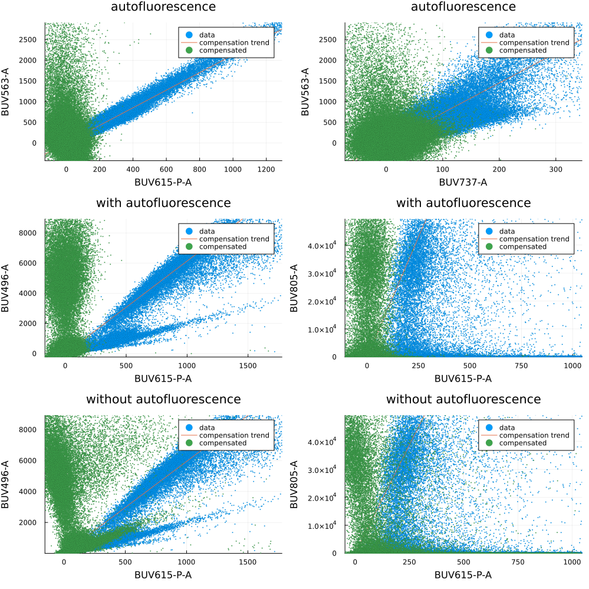

# Autofluorescence compensation

In here we explain how to perform channel compensation. We reproduce in this scrip Figure 2 from [Roca et all (2021)](https://www.nature.com/articles/s41467-021-23126-8).

The dataset employed in this example is:

 - [HS1](https://flowrepository.org/id/FR-FCM-Z2ST)


```julia
using FlowCytometry
using Plots
using DataFrames
using CSV
```

    ┌ Info: Precompiling FlowCytometry [dda4a566-a714-4635-9e97-d7f3f719a55d]
    └ @ Base loading.jl:1342


<div style="padding: 1em; background-color: #f8d6da; border: 1px solid #f5c6cb; font-weight: bold;">
<p>The WebIO Jupyter extension was not detected. See the
<a href="https://juliagizmos.github.io/WebIO.jl/latest/providers/ijulia/" target="_blank">
    WebIO Jupyter integration documentation
</a>
for more information.
</div>


```julia
data = CSV.read("FlowRepository_FR-FCM-Z2ST_files/attachments/fcs_control_hs1.csv",DataFrame)
dic = Dict([string("FlowRepository_FR-FCM-Z2ST_files/",i)=>string(j) for (i,j) in eachrow(data[:,["filename","dye"]])])
```


    Dict{String, String} with 23 entries:
      "FlowRepository_FR-FCM-Z2ST_files/Single color controls CD4_C… => "BV605-A"
      "FlowRepository_FR-FCM-Z2ST_files/Single color controls CD4_C… => "BB630-A"
      "FlowRepository_FR-FCM-Z2ST_files/Single color controls CD4_C… => "PE-Cy5.5-A"
      "FlowRepository_FR-FCM-Z2ST_files/Single color controls ST1 P… => "BUV805-A"
      "FlowRepository_FR-FCM-Z2ST_files/Single color controls ST1 P… => "BV480-A"
      "FlowRepository_FR-FCM-Z2ST_files/Single color controls CD4_C… => "APC-H7-A"
      "FlowRepository_FR-FCM-Z2ST_files/Single color controls ST1 P… => "BV421-A"
      "FlowRepository_FR-FCM-Z2ST_files/Single color controls CD4_C… => "BUV615-P-A"
      "FlowRepository_FR-FCM-Z2ST_files/Single color controls ST1 P… => "BUV737-A"
      "FlowRepository_FR-FCM-Z2ST_files/Single color controls CD4_C… => "BYG584-A"
      "FlowRepository_FR-FCM-Z2ST_files/Single color controls ST1 P… => "BB660-P-A"
      "FlowRepository_FR-FCM-Z2ST_files/Single color controls ST1 P… => "BYG790-A"
      "FlowRepository_FR-FCM-Z2ST_files/Single color controls CD4_C… => "APC-A"
      "FlowRepository_FR-FCM-Z2ST_files/Single color controls ST1 P… => "BV650-A"
      "FlowRepository_FR-FCM-Z2ST_files/Single color controls CD4_C… => "BV786-A"
      "FlowRepository_FR-FCM-Z2ST_files/Single color controls CD4_C… => "BV750-P-A"
      "FlowRepository_FR-FCM-Z2ST_files/Single color controls ST1 P… => "BUV496-A"
      "FlowRepository_FR-FCM-Z2ST_files/Single color controls CD4_C… => "PE-CF594-A"
      "FlowRepository_FR-FCM-Z2ST_files/Single color controls ST1 P… => "BB700-P-A"
      "FlowRepository_FR-FCM-Z2ST_files/Single color controls CD4_C… => "BYG670-A"
      "FlowRepository_FR-FCM-Z2ST_files/Single color controls ST1 P… => "BV570-A"
      "FlowRepository_FR-FCM-Z2ST_files/Single color controls CD4_C… => "BV711-A"
      "FlowRepository_FR-FCM-Z2ST_files/Single color controls CD4_C… => "FITC-A"


```julia
fcsWOAutofluorescence = loadFCControls(dic);
channelsCompensate = data[:,"dye"];
Compensation.computeCompensationMatrix!(fcsWOAutofluorescence,channelsCompensate=channelsCompensate)
```

    Not all control files have the same number of channels. These channels will not be compensated for controls that does not have them.
     Channels not present in all files: Any["FSC-W", "SSC-H", "SSC-W"]


    Computing S(0)... 100%|██████████████████████████████████| Time: 0:00:08
    Refinement Iterations... 100%|███████████████████████████| Time: 0:00:01


```julia
data = CSV.read("FlowRepository_FR-FCM-Z2ST_files/attachments/fcs_control_hs1_autofluorescence_correction.csv",DataFrame)
dic = Dict([string("FlowRepository_FR-FCM-Z2ST_files/",i)=>string(j) for (i,j) in eachrow(data[:,["filename","dye"]])])

fcsWAutofluorescence = loadFCControls(dic);
channelsCompensate = data[:,"dye"];
Compensation.computeCompensationMatrix!(fcsWAutofluorescence,channelsCompensate=channelsCompensate)
```

    Not all control files have the same number of channels. These channels will not be compensated for controls that does not have them.
     Channels not present in all files: Any["FSC-W", "SSC-H", "SSC-W"]


    Computing S(0)... 100%|██████████████████████████████████| Time: 0:00:01
    Refinement Iterations... 100%|███████████████████████████| Time: 0:00:02


```julia
f = FCSPloting.plotControls(fcsWAutofluorescence,
    [
        ("FITC-A","BUV563-A","BUV615-P-A"),("FITC-A","BUV563-A","BUV737-A"),
        ("BUV496-A","BUV496-A","BUV615-P-A"),("BUV805-A","BUV805-A","BUV615-P-A"),
        ])

f2 = FCSPloting.plotControls(fcsWOAutofluorescence,
    [
        ("BUV496-A","BUV496-A","BUV615-P-A"),("BUV805-A","BUV805-A","BUV615-P-A"),
        ])

fs = [plot(fig,title=title) for (fig,title) in zip([f;f2],["autofluorescence","autofluorescence","with autofluorescence","with autofluorescence","without autofluorescence","without autofluorescence"])]
plot(fs..., layout = (3,2), fmt=:png, size=(1000,1000))
```


    

    


```julia
Compensation.compensate!(fcsWAutofluorescence)
```
