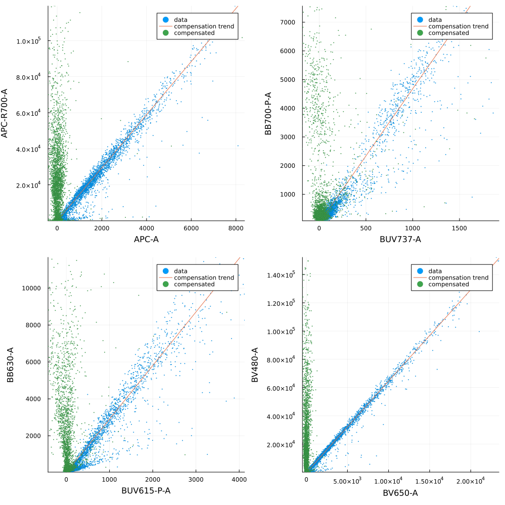

# Compensation

In here we explain how to perform channel compensation. We reproduce in this scrip Figure 2 from [Roca et all (2021)](https://www.nature.com/articles/s41467-021-23126-8).

The dataset employed in this example is:

 - [MM1](https://flowrepository.org/id/FR-FCM-Z2SS)


```julia
using FlowCytometry
using CSV
using DataFrames
using Plots
```


```julia
data = CSV.read("FlowRepository_FR-FCM-Z2SS_files/attachments/fcs_control.csv",DataFrame)
dic = Dict([string("FlowRepository_FR-FCM-Z2SS_files/",i)=>string(j) for (i,j) in eachrow(data[:,["filename","dye"]])])
```


    Dict{String, String} with 28 entries:
      "FlowRepository_FR-FCM-Z2SS_files/Compensation Controls_BYG79… => "BYG790-A"
      "FlowRepository_FR-FCM-Z2SS_files/Compensation Controls_BV786… => "BV786-A"
      "FlowRepository_FR-FCM-Z2SS_files/Compensation Controls_BUV80… => "BUV805-A"
      "FlowRepository_FR-FCM-Z2SS_files/Compensation Controls_BV605… => "BV605-A"
      "FlowRepository_FR-FCM-Z2SS_files/Compensation Controls_BV650… => "BV650-A"
      "FlowRepository_FR-FCM-Z2SS_files/Compensation Controls_BB660… => "BB660-P-A"
      "FlowRepository_FR-FCM-Z2SS_files/Compensation Controls_BB700… => "BB700-P-A"
      "FlowRepository_FR-FCM-Z2SS_files/Compensation Controls_BUV73… => "BUV737-A"
      "FlowRepository_FR-FCM-Z2SS_files/Compensation Controls_BV750… => "BV750-P-A"
      "FlowRepository_FR-FCM-Z2SS_files/Compensation Controls_APC S… => "APC-A"
      "FlowRepository_FR-FCM-Z2SS_files/Compensation Controls_BB790… => "BB790-P-A"
      "FlowRepository_FR-FCM-Z2SS_files/Compensation Controls_APC-R… => "APC-R700-A"
      "FlowRepository_FR-FCM-Z2SS_files/Compensation Controls_BV570… => "BV570-A"
      "FlowRepository_FR-FCM-Z2SS_files/Compensation Controls_PE-CF… => "PE-CF594-A"
      "FlowRepository_FR-FCM-Z2SS_files/Compensation Controls_FITC … => "FITC-A"
      "FlowRepository_FR-FCM-Z2SS_files/Compensation Controls_BV421… => "BV421-A"
      "FlowRepository_FR-FCM-Z2SS_files/Compensation Controls_BB630… => "BB630-A"
      "FlowRepository_FR-FCM-Z2SS_files/Compensation Controls_BYG58… => "BYG584-A"
      "FlowRepository_FR-FCM-Z2SS_files/Compensation Controls_BV480… => "BV480-A"
      "FlowRepository_FR-FCM-Z2SS_files/Compensation Controls_BUV49… => "BUV496-A"
      "FlowRepository_FR-FCM-Z2SS_files/Compensation Controls_BYG67… => "BYG670-A"
      "FlowRepository_FR-FCM-Z2SS_files/Compensation Controls_APC-H… => "APC-H7-A"
      "FlowRepository_FR-FCM-Z2SS_files/Compensation Controls_BUV61… => "BUV615-P-A"
      "FlowRepository_FR-FCM-Z2SS_files/Compensation Controls_BUV39… => "BUV395-A"
      "FlowRepository_FR-FCM-Z2SS_files/Compensation Controls_BV711… => "BV711-A"
      ⋮                                                              => ⋮


```julia
fcsMM1 = loadFCControls(d);
```


```julia
channelsCompensate = data[:,"dye"];
```


```julia
Compensation.computeCompensationMatrix!(fcsMM1,channelsCompensate=channelsCompensate)
```


```julia
f = FCSPloting.plotControls(fcsMM1,[("APC-R700-A","APC-R700-A","APC-A"),("BB700-P-A","BB700-P-A","BUV737-A"),("BB630-A","BB630-A","BUV615-P-A"),("BV480-A","BV480-A","BV650-A")])

plot(f..., layout = (2,2), fmt=:png, size=(1000,1000))
```


    

    


```julia
Compensation.compensate!(fcsMM1)
```
