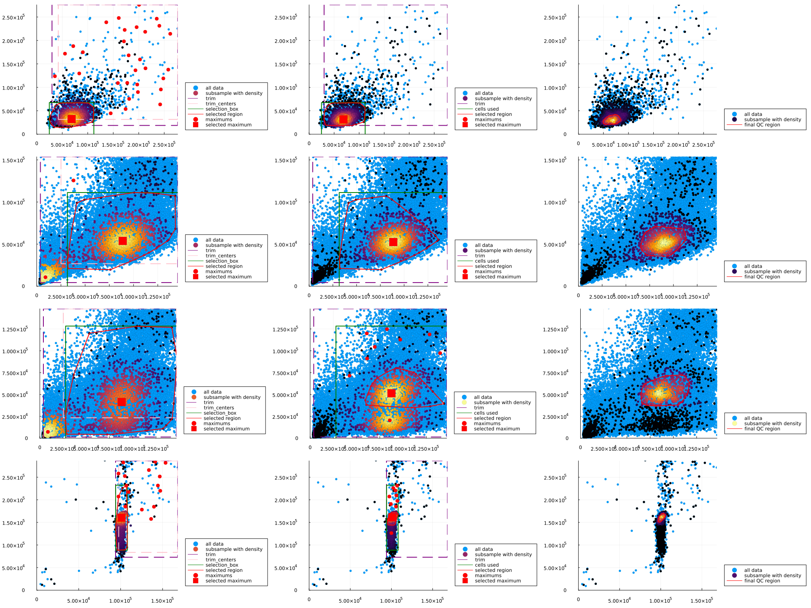

# Automatic Quality Control

In here we explain how to perform automatic gating inside the pipeline. We reproduce in this scrip Figure 1 from [Roca et all (2021)](https://www.nature.com/articles/s41467-021-23126-8).

The datasets employed in this example are:

 - [MM1](https://flowrepository.org/id/FR-FCM-Z2SS)
 - [HS1 & HS2](https://flowrepository.org/id/FR-FCM-Z2ST)
 - [Be1](https://flowrepository.org/id/FR-FCM-Z2SV)


```julia
using FlowCytometry
using Plots
```


<div style="padding: 1em; background-color: #f8d6da; border: 1px solid #f5c6cb; font-weight: bold;">
<p>The WebIO Jupyter extension was not detected. See the
<a href="https://juliagizmos.github.io/WebIO.jl/latest/providers/ijulia/" target="_blank">
    WebIO Jupyter integration documentation
</a>
for more information.
</div>


## Loading data


```julia
fcsMM1 = loadFCExperiment("FlowRepository_FR-FCM-Z2SS_files/Compensation Controls_APC Stained Control_006.fcs")
fcsHS1 = loadFCExperiment("FlowRepository_FR-FCM-Z2ST_files/Single color controls ST1 PANEL_CD45RA FITC_047.fcs")
fcsHS2 = loadFCExperiment("FlowRepository_FR-FCM-Z2ST_files/Single color controls ST1 PANEL_CD14 PECY55_050.fcs")
fcsBe1 = loadFCExperiment("FlowRepository_FR-FCM-Z2SV_files/Compensation Controls_APC Stained Control_007.fcs");
```

## Computing automatic QC gates

The algorithm employed in [Roca et all (2021)](https://www.nature.com/articles/s41467-021-23126-8). For most part of the datasets, the parameters are robust and we will not need to change them. The most relevant parameters are:

 - **trim=(0.01,0.99)** Percentile range in the channel ranges to use in the analysis before finding maximums.
 - **maxtrim=.05** Minimum in the range channels where to accept maximum points. This avoids the peak present in some datasets at lower expressions (debris).
 - **densityBandwidth=(.5,.3)** Relative bandwidth to smooth the density plots.
 - **finalBandwidth=.1** Relative bandwidth to smooth the density plots in the final step.
 - **heightFromMax=.3** In the last step, heigh at global maximum where to draw the contour of the QC region. Points with more probability that that will be used to make the QC gate.
 - **subsample=2000** Subsample of points used for density steps of the system. Set to 'nothing' for using all the points (this can be extremely slow), with relative low numbers of points the gate output are already very good.

We can directly apply the algorithm for the datasets from above:


```julia
Gating.automaticQC!(fcsMM1);
Gating.automaticQC!(fcsHS1,maxtrim=0.15); #We choose a higher maxtrim to avoid the maximum at very low counts that appear in this dataset and that is probably debris
Gating.automaticQC!(fcsHS2,maxtrim=0.15); #We choose a higher maxtrim to avoid the maximum at very low counts that appear in this dataset and that is probably debris
Gating.automaticQC!(fcsBe1);
```

## Visualize results of QC

Finally we can see the results from the pipeline.


```julia
f1 = FCSPloting.plotQCSteps(fcsMM1)
f2 = FCSPloting.plotQCSteps(fcsHS1)
f3 = FCSPloting.plotQCSteps(fcsHS2)
f4 = FCSPloting.plotQCSteps(fcsBe1)

f = plot(
f1,
f2,
f3,
f4,
layout=(4,1), fmt=:png, size=(2000,1500)
    )
```


    

    


## Gate the cells and remove cell that are not is our interest

Finally we can remove cells that are not of use.


```julia
Gating.filterByGate!(fcsMM1,"automaticQC")
Gating.filterByGate!(fcsHS1,"automaticQC")
Gating.filterByGate!(fcsHS2,"automaticQC")
Gating.filterByGate!(fcsBe1,"automaticQC")
```


```julia
removeCells!(fcsMM1,fcsMM1.obs[:,"automaticQC_gate"])
removeCells!(fcsHS1,fcsHS1.obs[:,"automaticQC_gate"])
removeCells!(fcsHS2,fcsHS2.obs[:,"automaticQC_gate"])
removeCells!(fcsBe1,fcsBe1.obs[:,"automaticQC_gate"])
```
