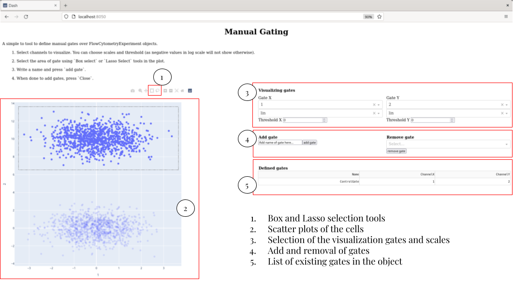
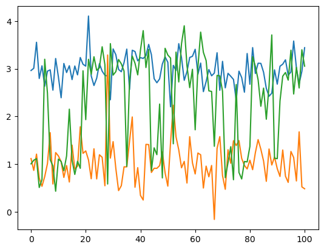
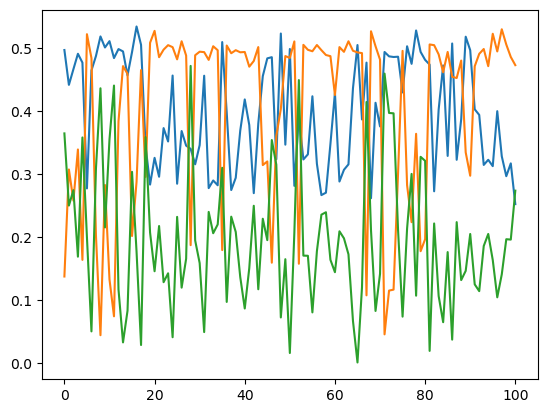

# Usage

We are going over the main functionality of the FlowCytometry package.

For this tutorial you will need to have installed the following packages:

 - FlowCytometry 
 - Plots for the visualization of the results
 - CSV for uploading files
 - DataFrames as storage 
 
First we upload the required packages.


```julia
using FlowCytometry
using PyPlot
using CSV
using DataFrames
```

    ┌ Info: Precompiling FlowCytometry [dda4a566-a714-4635-9e97-d7f3f719a55d]
    └ @ Base loading.jl:1342
    WARNING: Method definition compensate!(FlowCytometry.FlowCytometryExperiment) in module Compensation at /home/gabriel/Documents/FlowCytometry/src/compensation.jl:155 overwritten at /home/gabriel/Documents/FlowCytometry/src/compensation.jl:188.
      ** incremental compilation may be fatally broken for this module **
    
    ┌ Warning: Replacing docs for `FlowCytometry.Compensation.compensate! :: Tuple{FlowCytometry.FlowCytometryExperiment}` in module `FlowCytometry.Compensation`
    └ @ Base.Docs docs/Docs.jl:240


<div style="padding: 1em; background-color: #f8d6da; border: 1px solid #f5c6cb; font-weight: bold;">
<p>The WebIO Jupyter extension was not detected. See the
<a href="https://juliagizmos.github.io/WebIO.jl/latest/providers/ijulia/" target="_blank">
    WebIO Jupyter integration documentation
</a>
for more information.
</div>


## Basics of the FlowCytometry.jl structures

The Flow cytometry package works around a few structures that help with the upload and manipulation of flow cytometry data.

The basic structure is **FlowCytometryExperiment**. The structure follows a very similar struture to the AnnData object for scRNA seq analysis of [Scanpy](https://scanpy.readthedocs.io/en/latest/usage-principles.html#anndata).

### Loading

We can construct it manually starting from a measures matrix. Let's make a initialization of experiment with 100 cells and 10 channels.


```julia
fcs = FlowCytometryExperiment(rand(100,10));
```

Alternatively, we can directly load a fcs experiment.


```julia
fcs = loadFCExperiment("FlowRepository_FR-FCM-Z2SS_files/Compensation Controls_APC Stained Control_006.fcs");
```

### Accesing the properties

The structure contains several properties useful for the analysis.

 - **X** Matrix of Cells X Channel of the experiment.
 - **obs** Dataframe with all the metainformation of the cells
 - **var** Dataframe with all the metainformation of the channels
 - **obsm** Dictionary containing transformed matrices of the original data.
 - **layers** Dictionary containing Cells X Channel matrices of data that are required to control (e.g. Raw matrix).
 - **gates** List of Gate and Gate set objects
 - **uns** Dictionary contining all the metainformation of algorithms applied to the data.
 
The data uploaded before contains for now a matrix with 5000 cells and 35 channels.


```julia
fcs.X
```

The experiment metainformation has been stored in `.uns["ExperimentInformation"]`.


```julia
fcs.uns["ExperimentInformation"]
```

And we have the name of the channels in `.channels`.


```julia
fcs.channels
```

It is useful to note than the channels can be accessed directly by calling directly to the FlowCytometryExperiment object as `fcs[channel_of_interest]`. Let's use this property for ploting a scatterplot of two channels.


```julia
fig, ax = subplots(1,1)
ax.scatter(fcs["APC-A"],fcs["APC-R700-A"],s=10)
ax.set_xlabel("APC-R700-A")
ax.set_ylabel("APC-A")
ax.set_title("Control experiment APC Dye")
```

We can already see from this data the spillover effect of APC-A to APC-R700-A.

## Gating

Flow compensation usually requires of quality control of the cells and measures change in proportion of cells between experimennts to see if there is changes in the number of cells present in specific regions of the channel space.

We can define gates for our experiment in several ways.

### Manual gating

We can define a manual gates by calling the function `Gating.manualGating!`. This will start an app that can be accessed in any browser by writing `localhost::channel`, for the channel prompted by the function. When desiring to stop adding gates, you will have just to kill the app with `ctr+C` or similar and the gates will be added to the `FlowCytometryExperiment` object.


```julia
Gating.manualGating!(fcs)
```

When calling the function, in the browser you will see a page like this:




### Automatic gating


```julia
using Statistics, LinearAlgebra
```


```julia
det(cov(rand(20,20)))
```


```julia
mean(rand(4,5),dims=1)[1,:]
```


```julia
automaticQC!(fcs)
```


```julia
fig,ax = subplots(1,5,figsize=[25,3])

ax[1].fill([i[1] for i in fcs.uns["automaticQC"]["Step1_TrimOutliers"]],[i[2] for i in fcs.uns["automaticQC"]["Step1_TrimOutliers"]],alpha=0.5,zorder=-1,color="lightBlue")
ax[1].scatter(fcs["FSC-A"],fcs["SSC-A"],s=2)

ax[2].fill([i[1] for i in fcs.uns["automaticQC"]["Step1_TrimOutliers"]],[i[2] for i in fcs.uns["automaticQC"]["Step1_TrimOutliers"]],alpha=0.5,zorder=-1,color="lightBlue")
ax[2].fill([i[1] for i in fcs.uns["automaticQC"]["Step2_ExcludeMaximums"]],[i[2] for i in fcs.uns["automaticQC"]["Step2_ExcludeMaximums"]],alpha=0.5,zorder=-1,color="orange")
ax[2].scatter(fcs["FSC-A"],fcs["SSC-A"],c=fcs.obs[:,"automaticQC_density1"],cmap="Spectral_r",s=2)
ax[2].scatter(fcs.uns["automaticQC"]["Step3_LocalMaximums"][1],fcs.uns["automaticQC"]["Step3_LocalMaximums"][2],color="k",s=50)
ax[2].scatter([fcs.uns["automaticQC"]["Step4_GlobalMaximum"][1]],[fcs.uns["automaticQC"]["Step4_GlobalMaximum"][2]],color="orange",s=50)

ax[3].fill([i[1] for i in fcs.uns["automaticQC"]["Step1_TrimOutliers"]],[i[2] for i in fcs.uns["automaticQC"]["Step1_TrimOutliers"]],alpha=0.5,zorder=-1,color="lightBlue")
ax[3].fill([i[1] for i in fcs.uns["automaticQC"]["Step5_Tesselation"]],[i[2] for i in fcs.uns["automaticQC"]["Step5_Tesselation"]],alpha=0.5,zorder=-1,color="orange")
ax[3].scatter(fcs["FSC-A"],fcs["SSC-A"],c=fcs.obs[:,"automaticQC_density1"],cmap="Spectral_r",s=2)
ax[3].scatter(fcs.uns["automaticQC"]["Step3_LocalMaximums"][1],fcs.uns["automaticQC"]["Step3_LocalMaximums"][2],color="k",s=50)
ax[3].scatter([fcs.uns["automaticQC"]["Step4_GlobalMaximum"][1]],[fcs.uns["automaticQC"]["Step4_GlobalMaximum"][2]],color="orange",s=50)

ax[4].fill([i[1] for i in fcs.uns["automaticQC"]["Step1_TrimOutliers"]],[i[2] for i in fcs.uns["automaticQC"]["Step1_TrimOutliers"]],alpha=0.5,zorder=-1,color="lightBlue")
ax[4].fill([i[1] for i in fcs.uns["automaticQC"]["Step6_Rectangle"]],[i[2] for i in fcs.uns["automaticQC"]["Step6_Rectangle"]],alpha=0.5,zorder=-1,color="orange")
ax[4].scatter(fcs["FSC-A"],fcs["SSC-A"],c=fcs.obs[:,"automaticQC_density1"],cmap="Spectral_r",s=2)
ax[4].scatter(fcs.uns["automaticQC"]["Step3_LocalMaximums"][1],fcs.uns["automaticQC"]["Step3_LocalMaximums"][2],color="k",s=50)
ax[4].scatter([fcs.uns["automaticQC"]["Step4_GlobalMaximum"][1]],[fcs.uns["automaticQC"]["Step4_GlobalMaximum"][2]],color="orange",s=50)

ax[5].fill([i[1] for i in fcs.gates["automaticQC"].polygon],[i[2] for i in fcs.gates["automaticQC"].polygon],alpha=1,facecolor="none",edgecolor="red")
ax[5].scatter(fcs["FSC-A"],fcs["SSC-A"],c=fcs.obs[:,"automaticQC_density1"],cmap="Spectral_r",s=2)
ax[5].scatter(fcs.uns["automaticQC"]["Step3_LocalMaximums"][1],fcs.uns["automaticQC"]["Step3_LocalMaximums"][2],color="k",s=50)
ax[5].scatter([fcs.uns["automaticQC"]["Step4_GlobalMaximum"][1]],[fcs.uns["automaticQC"]["Step4_GlobalMaximum"][2]],color="orange",s=50)

for a in ax
    a.set_xlim(0,30E4)
    a.set_ylim(0,30E4)
    a.set_xticks([0,30E4])
    a.set_yticks([0,30E4])
end

```

## Compensation

Most part of flow cytometry experiments use several signaling channels. Some of the most common experimental as flow cytometry or spectral cytometry suffer from spillover/mixing of the information among the channels. To correct this behavior and having uncoupled signals, one-fluorophore control experiments are performed in order to compute what is called the compensation matrice to uncouple the channels.

### Loading control experiments

We can upload the control experiments in a special structure named `FlowCytometryControl`, that is more less a container of diferent `FlowCytometryExperiment`. Each control experiment is assigned a channel that corresponds to the maximum peack of its spectrum. This is very important to when computing the compensation matrix. The best way of uploading the data is by assigning the different control files to the according channels.

In this example we have a file that has already this assignation:


```julia
controls = CSV.read("FlowRepository_FR-FCM-Z2SS_files/attachments/fcs_control.csv",FlowCytometry.DataFrame)
print(controls[1:5,:])
```

We will construct a dictionary assigning file to channel.


```julia
fileChannelAssignation = Dict([string("FlowRepository_FR-FCM-Z2SS_files/",i)=>String(j) for (i,j) in eachrow(controls[:,["filename","dye"]])])
```

Now we can load the data.


```julia
fcsControl = loadFCControls(fileChannelAssignation);
```

### Compute compensation matrix

With the data uploaded we can compute the compensation matrix from the `FlowCytometryControl` object.


```julia
Compensation.computeCompensationMatrix!(fcsControl)
```

### Compensate datasets

With the compensated matrix computed, we can compensate the data. There are several methods of proceeding with the compensation.

 1. Compensate the control data


```julia
experimentUncompensated = deepcopy(fcsControl.controls["APC-A"]) #Make a copy before compensation
Compensation.compensate!(fcsControl)
```

Now we can visualize the results of the compensation and see that it has been correctly compensated.


```julia
experiment = fcsControl.controls["APC-A"]
scatter(experimentUncompensated["APC-A"],experimentUncompensated["APC-R700-A"],label="Not compensated")
scatter!(experiment["APC-A"],experiment["APC-R700-A"],label="Compensated",xlabel="APC-A",ylabel="APC-R700-A",title="Control APC-A")
xlabel!("APC-A")
ylabel!("APC-R700-A")
```

 2. Compensate the a `FlowCytometryExperiment` object with a `FlowCytometryControl` object


```julia
fcsCopy = deepcopy(fcs)
Compensation.compensate!(fcsCopy,control=fcsControl)
```

 3. Assign the compensation matrix of a `FlowCytometryControl` to a `FlowCytometryExperiment` and then compensate.


```julia
fcsCopy = deepcopy(fcs)
Compensation.assignCompensation!(fcsCopy,control=fcsControl)
Compensation.compensate!(fcsCopy)
```

## Dimensionality reduction

In some datasets, the data is very high dimensional and visualizing all pairwise steps may not be possible or hard to interpret. For that reason, we can apply several dimensionality reduction methods to summarize the data.

Let's see that by constructing a toy dataset with two cell types. This data doesn't show well separated by any particular plot in of two of the variables. However, PCA analysis or UMAP projection are able to show the separation between the two clusters.

All this visualizations are stored as transformations of the original data in `.obms`.


```julia
X = [randn(1000,10); (randn(1000,10).+[0 2 0 2 0 2 0 2 0 0])];
fcs = FlowCytometryExperiment(X);
```


```julia
DimensionalityReduction.pca!(fcs)
```


```julia
DimensionalityReduction.umap!(fcs)
```


```julia
plot(scatter(fcs["1"],fcs["2"],title="Variables"),
    scatter(fcs.obsm["pca"][:,1],fcs.obsm["pca"][:,2],title="PC"),
    scatter(fcs.obsm["umap"][:,1],fcs.obsm["umap"][:,2],title="UMAP"),
    layout=(1,3),legend=false,size=[1200,400])
```

## Clustering 

One of the main uses of cytometry data is to cluster data by cell types. Several methods are already implemented in the package. Resuing the toy model before.


```julia
Clustering.kmeans!(fcs,n_components=2)
```


```julia
Clustering.agglomerative!(fcs,n_components=2)
```


```julia
plot(scatter(fcs.obsm["pca"][:,1],fcs.obsm["pca"][:,2],markercolor=Array(fcs.obs[:,"kmeans"]),title="KMeans"),
    scatter(fcs.obsm["pca"][:,1],fcs.obsm["pca"][:,2],markercolor=Array(fcs.obs[:,"agglomerative"]),title="Agglomerative"),
    layout=(1,2),legend=false,size=[800,400])
```


```julia
using Distributions
```


```julia
c = [.1 .01 .01;.01 .1 .02;.01 .02 .2]
X = permutedims(rand(MultivariateNormal([0,1,2],c),1000));
Y = permutedims(rand(MultivariateNormal([0,3,2],c),1000));
fcs = FlowCytometryExperiment([X;Y]);
```


```julia
Clustering.gaussianMixture!(fcs,k=3,initialization="kmeans",verbose=true)
```

    Progress: 100%|█████████████████████████████████████████| Time: 0:00:03
      iter:  2000


```julia
plot(fcs.uns["gaussianMixture"]["means"][:,1,2])
plot(fcs.uns["gaussianMixture"]["means"][:,2,2])
plot(fcs.uns["gaussianMixture"]["means"][:,3,2])
```


    

    


    1-element Vector{PyCall.PyObject}:
     PyObject <matplotlib.lines.Line2D object at 0x7f3aad1677f0>


```julia
for i in 1:3
    plot(fcs.uns["gaussianMixture"]["weights"][:,i])
end
```


    

    


```julia

```
